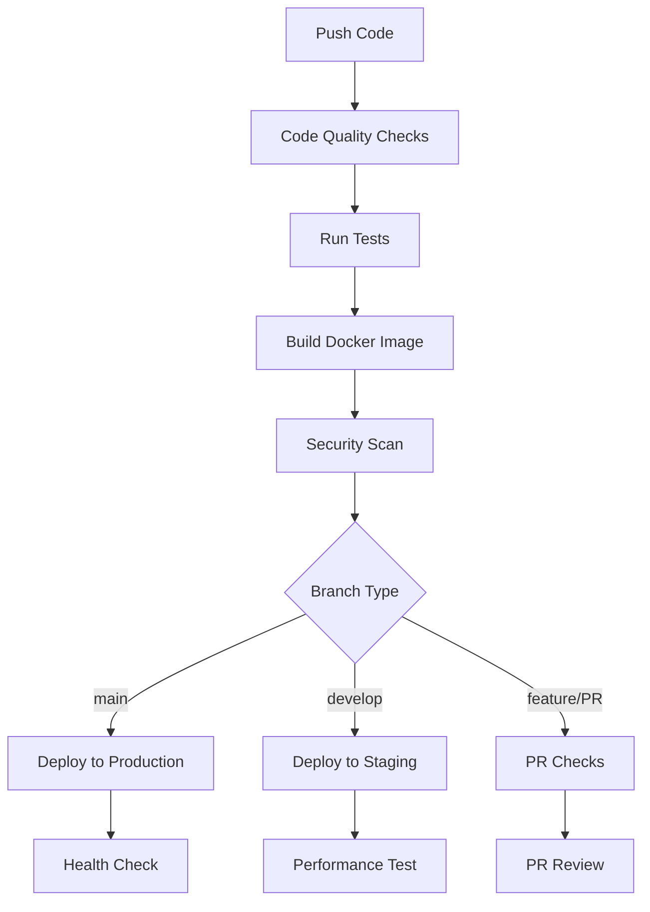

# 🚀 CI/CD 自动化流水线指南

## 概述

SillyTavern Perfect Clone 配置了完整的 CI/CD 自动化流水线，提供代码质量检查、自动化测试、构建部署和监控等全流程自动化。

## 🏗️ 流水线架构

### 📊 工作流概览



## 🔍 主要工作流

### 1. 🚀 主CI/CD流水线 (`ci-cd.yml`)

**触发条件:**
- 推送到 `main` 或 `develop` 分支
- 创建针对 `main` 分支的 Pull Request
- 发布新版本

**包含阶段:**
- ✅ 代码质量检查
- 🧪 单元测试和集成测试
- 🐳 Docker镜像构建
- 🔒 安全扫描
- 🚀 自动部署
- 📊 性能测试

### 2. 🐳 Docker工作流 (`docker.yml`)

**触发条件:**
- 推送到任何分支
- 创建标签
- 每周定时检查

**包含阶段:**
- 🔍 Dockerfile语法检查
- 🐳 多平台镜像构建 (amd64, arm64)
- 🔍 Trivy安全扫描
- 🧪 镜像测试

### 3. 🔍 代码质量工作流 (`quality.yml`)

**触发条件:**
- 推送到 `main` 或 `develop` 分支
- Pull Request

**包含阶段:**
- 📦 依赖安全检查
- 🎨 代码风格检查 (ESLint, Prettier)
- 🏗️ TypeScript检查
- 📊 复杂度分析
- 📖 文档检查

### 4. 🏷️ 发布工作流 (`release.yml`)

**触发条件:**
- 推送标签 (如 `v1.0.0`)
- 手动触发

**包含阶段:**
- 🏷️ 创建GitHub Release
- 🐳 构建和发布Docker镜像
- 📦 发布到NPM
- 📧 发布通知

### 5. 📦 依赖管理工作流 (`dependencies.yml`)

**触发条件:**
- 每周一早上8点定时检查
- 手动触发

**包含阶段:**
- 🔍 检查过时的依赖
- 🧪 测试依赖更新
- 🔒 安全漏洞修复
- 📋 自动创建更新PR

## 🛠️ 环境配置

### 🏭 环境分层

| 环境 | 用途 | 分支 | 自动部署 |
|------|------|------|----------|
| **Development** | 开发测试 | `feature/*`, `develop` | ❌ |
| **Staging** | 预发布测试 | `develop` | ✅ |
| **Production** | 生产环境 | `main` | ✅ |

### 🔐 Secrets 配置

需要在GitHub仓库中配置以下Secrets：

```bash
# 🔑 必需的Secrets
GITHUB_TOKEN              # GitHub API token (自动提供)
GITHUB_REPOSITORY_TOKEN   # 仓库访问token

# 🔐 可选的Secrets
NPM_TOKEN                  # NPM发布token
SONAR_TOKEN                # SonarCloud分析token
SENTRY_DSN                 # 错误监控token
SLACK_WEBHOOK_URL          # Slack通知webhook
DISCORD_WEBHOOK_URL        # Discord通知webhook
TWITTER_API_KEY            # Twitter API key
TWITTER_ACCESS_TOKEN       # Twitter访问token
```

### 📝 配置Secrets

1. 进入GitHub仓库设置
2. 点击 "Secrets and variables" > "Actions"
3. 点击 "New repository secret"
4. 添加上述必要的Secrets

## 🚀 使用指南

### 🔍 本地开发

```bash
# 运行代码质量检查
npm run lint
npm run type-check
npm run format:check

# 运行测试
npm run test:unit
npm run test:integration

# 构建项目
npm run build

# Docker构建
npm run docker:build
npm run docker:up
```

### 📋 提交规范

使用 Conventional Commits 规范：

```bash
# 功能提交
git commit -m "feat: add AI model configuration"

# 修复提交
git commit -m "fix: resolve memory leak in chat component"

# 样式提交
git commit -m "style: format code with prettier"

# 重构提交
git commit -m "refactor: optimize database queries"

# 测试提交
git commit -m "test: add integration tests for API"

# 文档提交
git commit -m "docs: update deployment guide"
```

### 🏷️ 发布版本

#### 自动发布 (推荐)
1. 推送标签到仓库：
   ```bash
   git tag v1.0.0
   git push origin v1.0.0
   ```

#### 手动触发发布
1. 进入Actions页面
2. 选择 "Release Workflow"
3. 点击 "Run workflow"
4. 输入版本信息

### 🔄 分支策略

```bash
# 主分支
main                    # 生产环境代码
develop                 # 开发集成分支
feature/feature-name    # 功能开发分支
hotfix/issue-fix       # 紧急修复分支
release/v1.0.0        # 发布准备分支
```

## 📊 监控和报告

### 🔍 质量监控

- **代码覆盖率**: GitHub Actions + Codecov
- **代码复杂度**: SonarCloud
- **安全扫描**: Trivy + Snyk
- **性能测试**: Lighthouse CI

### 📧 通知系统

- **Slack**: 部署状态和构建通知
- **Discord**: 发布通知
- **Twitter**: 新版本发布
- **Email**: 错误和失败通知

### 📋 报告查看

1. **GitHub Actions**: 实时构建状态
2. **Codecov**: 代码覆盖率报告
3. **SonarCloud**: 代码质量分析
4. **Docker Hub**: 镜像构建历史
5. **NPM**: 包版本历史

## 🛠️ 故障排除

### 🔧 常见问题

#### 1. 构建失败
```bash
# 检查本地构建
npm run ci

# 清理缓存
npm cache clean --force
rm -rf node_modules package-lock.json
npm install
```

#### 2. 测试失败
```bash
# 运行特定测试
npm run test:unit
npm run test:integration

# 检查测试覆盖率
npm run test:coverage
```

#### 3. Docker构建失败
```bash
# 本地测试Docker构建
docker build -t test-build .

# 检查Dockerfile语法
hadolint Dockerfile
```

#### 4. 权限问题
```bash
# 检查GitHub Actions权限
# Settings > Actions > General > Workflow permissions
```

### 🔍 调试技巧

#### 查看详细日志
```bash
# 查看Actions日志
# GitHub仓库 > Actions > 选择workflow > 查看详细日志

# 本地调试
ACT=1 npm run test
```

#### 本地运行Actions
```bash
# 安装act工具
npm install -g act

# 运行特定workflow
act -j build-image
```

## 🔧 自定义配置

### 🎨 添加新的检查

1. 在 `.github/workflows/` 中创建新workflow
2. 复制现有workflow模板
3. 根据需要修改步骤

### 🐳 自定义Docker构建

```yaml
# .github/workflows/docker.yml
- name: 🐳 Custom Build Step
  run: |
    # 自定义构建逻辑
```

### 📧 自定义通知

```yaml
# .github/workflows/notifications.yml
- name: 📧 Custom Notification
  run: |
    # 自定义通知逻辑
```

## 📚 最佳实践

### ✅ 推荐做法

1. **保持构建快速**: 只运行必要的检查
2. **使用缓存**: Node.js、Docker层缓存
3. **并行执行**: 独立的job并行运行
4. **安全优先**: 定期扫描和更新依赖
5. **文档更新**: 及时更新CI/CD文档

### ❌ 避免做法

1. **硬编码敏感信息**: 使用Secrets管理
2. **超长workflow**: 保持单个workflow简洁
3. **忽略失败**: 及时处理构建失败
4. **跳过测试**: 确保所有测试通过
5. **过期配置**: 定期更新配置文件

## 🚀 进阶功能

### 🔄 多环境部署

```yaml
# 环境矩阵
strategy:
  matrix:
    environment: [staging, production]
    include:
      - environment: staging
        url: https://staging.sillytavern.com
      - environment: production
        url: https://sillytavern.com
```

### 🧪 集成测试环境

```yaml
# 测试矩阵
strategy:
  matrix:
    node-version: [18, 20]
    os: [ubuntu-latest, windows-latest]
```

### 📊 性能基准测试

```yaml
# 性能测试
- name: 📊 Performance Test
  run: |
    # Lighthouse CI
    npm run lighthouse
    # 性能基准对比
```

---

🎉 现在您的SillyTavern Perfect Clone已经拥有完整的CI/CD流水线！所有配置都已经就绪，您可以直接使用这些自动化工具来提高开发效率和代码质量。